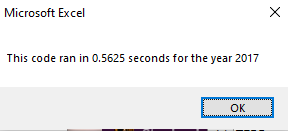
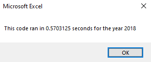
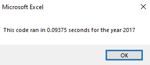
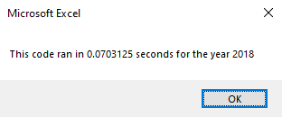

# stock-analysis

## Overview of Project
Using a dataset compiling stock volumes, starting prices, ending prices and ticker names and volumes, I created an automated workbook that instantly tabulates the stocks total volumes and returns for the year. Initially the workbook was designed utlizing variables and constants, however after refactoring the code and taking advantage of arrays, I was able to make the workbook much more efficient, providing results to clients much quicker.  

## Results

These two images above display the duration in which the analysis was run with the original workbook pre-refactoring.

These images detail the duration after code refactoring was performed, showing an improvement in run time and speed.
### The code breakdown - Arrrays
Old code will be featured first, refactored code after.

~~~
Dim startingPrice As Single
Dim endingPrice As Single

Dim tickerVolumes(12) As Long
Dim tickerStartingPrices(12) As Single
Dim tickerEndingPrices(12) As Single
~~~

In the original code, many aspects were originally declared as variables or constants. In the refactored code, we adjusted many of those into arrays. By doing this, when the data was adjusted later in the loops I created, the arrays work directly with the data- versus the old code from before, which as variables worked as references to the raw data. This small difference allowed for enhancement of speed.
###  initialization and iteration
~~~
For i = 0 To 11

    ticker = tickers(i)
    totalVolume = 0`

For i = 0 To 11
    tickerVolumes(i) = 0
    tickerStartingPrices(i) = 0
    tickerEndingPrices(i) = 0
~~~

#### Initialization
Initializing the totalVolume in the original code as 0 may have helped speed the original code up. In the refactored code, however, we can do the same with each now established array. By doing this, and setting each array index with an intial value of 0, this saves time. 
#### Iteration
Both the original code and refactored code had an established array of tickers. The original code iterated through the tickers, parsing through the entire dataset multiple times. During refactoring, by establishing tickerVolumes(12), tickerStartingPrices(12) and tickerEndingPrices(12) as arrays with similar indexing as our original tickers array, we are basically assuming that once we get to our final stage of outputting the code that at each index, as long as they "match" we will have the correct output. 

### For Loops, totalVolume vs tickerVolumes
~~~
For j = 2 To RowCount
    
        If Cells(j, 1).Value = ticker Then

               totalVolume = totalVolume + Cells(j, 8).Value

     
        End If
       If Cells(j - 1, 1).Value <> ticker And Cells(j, 1).Value = ticker Then

            startingPrice = Cells(j, 6).Value
            
        End If
        
        If Cells(j + 1, 1).Value <> ticker And Cells(j, 1).Value = ticker Then

            endingPrice = Cells(j, 6).Value
            
        End If
     Next j

For i = 2 To RowCount
    
    tickerVolumes(tickerIndex) = tickerVolumes(tickerIndex) + Cells(i, 8).Value
    
    'If  Then
    If Cells(i, 1).Value = tickers(tickerIndex) And Cells(i - 1, 1).Value <> tickers(tickerIndex) Then
        tickerStartingPrices(tickerIndex) = Cells(i, 6).Value
    End If
    
     If Cells(i, 1).Value = tickers(tickerIndex) And Cells(i + 1, 1).Value <> tickers(tickerIndex) Then
        tickerEndingPrices(tickerIndex) = Cells(i, 6).Value
     End If

         If Cells(i, 1).Value = tickers(tickerIndex) And Cells(i + 1, 1).Value <> tickers(tickerIndex) Then
            tickerIndex = tickerIndex + 1
        End If

Next i
~~~

#### For Loops
The initial workbook contained a nested loop. Because the inner loop continues to run while the outer loop is finished, each time the outer loop iterates, the inner loop goes over the entire data set again and again. To adjust this in the refactored workbook, I separated the for loops. The only way that this would have been possible is due to previously establishing the arrays.

#### totalVolume vs tickerVolumes

The totalVolume variable, is slower than the tickerVolumes array.

~~~
tickerVolumes(tickerIndex) = tickerVolumes(tickerIndex) + Cells(i, 8).Value
~~~

The refactored code featured two established arrays. The way I look at this is that one is a road address, while the other is directing you to the exact house you want to go to. Because these arrays work with raw data, as soon as they reach the Cells(i, 8) portion in which volume is being added, it is immediately stored within tickerVolumes(12) array, at tickerIndex Index (x). 

As the If statements and iterations work their way down, in the refactored code, it leads to :

~~~
tickerIndex= tickerIndex + 1 
~~~

In each If statement, each portion of the refactored code there is a featured (tickerIndex) call. This tickerIndex = tickerIndex + 1 code allows for the iteration to almost be at a certain "placeholder" within its process due to each array in each If statement being tied to the (tickerIndex). For this reason, the iteration doesn't need to work back through, for example, tickers(11) Index 0= return value of "AY", making its way to Index 1- it simply ends at the last iteration of tickerIndex 0, and then moves onto ticker Index 1, return value of CSIQ! In conjunction with the fact that we do not have to leave the singular for loop, this is a huge reason for speed improvement from the old workbook to the refactored one.

## Summary
### Advantages of Refactoring
When writing code, it is important to create an intial strucutre so that you can develop a well designed application that performs the necessary task. As you write, it's easy to pidgeon hole yourself into certain structures that may be repetitve, and maybe not the best solutions at all times. By refactoring code, you allow yourself, or your team, to make adjustments that take a project to the next level. These adjustments can lead to increased speed and efficiency, enhancing code readability, reducing bugs in code, as well as keeping code organized and maintenanced.

### Disadvantages of Refactoring
Refactoring may be problematic in cases where the application or software is older, or is in a language that maybe you or your team aren't familiar with. I could also see refactoring being an issue where teams of engineers are on different skill levels, in which if instructions aren't clear enough- there may be a lot of miscommunication and misunderstanding about just *what* the goal is and how to approach it with refactoring. Another disadvantage of refactoring or potential concern with it- is goal setting itself. If you have an application that runs fine, is it necessary to make it perform much faster? What if your adjustments cause the application to break- detailing risk assessment vs the gain from refactoring is an important concern.

### How the Pros and Cons of refactoring apply to this project

In this project, I was eager to refactor the original code. I experienced both a *pro* and a *con* during the whole process as as a beginner- I had to do a lot of learning on the fly in order to effectively understand which direction to go with the code, and more importantly *why*. So in a way, I am the inexperienced team member, but also in a way, through refactoring, got to experience stepping out of a repetitive pattern and into something more robust and powerful. Post refactoring, the code is more readable- and as long as someone knows what an array is and does, makes more sense in terms of data retrieval and storage. With this workbook, it was clear the goal was to make the code more readable, run more efficiently, and provide results. By using arrays and assuming the indexes would all match up, this may be a risky deal with anything perhaps larger than this workbook, so in that sense, I also got to get a sense of risk assessment as well. The original workbook set values to match the ticker value directly instead of using different arrays- the pro in this is that you are making sure that your search for that value isn't being interrupted prematurely by for example, improperly sorted data. This was slower, but I would consider it more "reliable." The new one looks for certain criteria to end the search for a specific ticker, but if there is any issue with sorting in the actual data set, this could have devastating consequences with the code output. The pros and cons essentially measure up to what is being asked and understanding as an engineer where the boundary may lie with speed and functionality.
